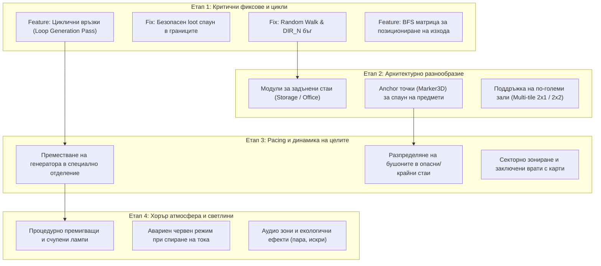

# Пътна карта и подобрения за процедурната генерация на нивата (Level Generation Roadmap)

Документът описва текущия алгоритъм за генерация на нивата в `NightShift` (`LevelGenerator.gd`), детайлен анализ на слабостите и бъговете, както и структуриран план за тяхното поетапно отстраняване и надграждане.

---

## 1. Обзор на текущия алгоритъм

В момента алгоритъмът работи върху 2D координатна мрежа с модули `32x32` метра:
1. **Инициализация**: Приема се `seed_val` и `floor_num`. Използва се `RandomNumberGenerator` с фиксиран сийд за пълна детерминираност между хоста и клиентите.
2. **Стартова точка**: Стартовият асансьор винаги се поставя на позиция `(0, 0)` с изход на север. Първият свързан коридор е `(0, -1)`.
3. **Главен Random Walk**: Извършва се случайно блуждаене с дължина `5 + floor_num * 2` за намиране на крайния изход (`end_pos`).
4. **Разклонения (Branching)**: Всяка стая по пътя има 40% шанс да пусне странично разклонение с дължина 1-3 клетки.
5. **Инстанциране чрез битови маски**: Всяка клетка пази битова маска ($N=1, E=2, S=4, W=8$), според която се избира и завърта съответният 3D модул (`ElevatorCabin`, `Room_Corridor`, `Room_Turn`, `Room_TJunction`, `Room_Cross`).
6. **Запечатване (Wall Capping)**: Ако даден модул има отворен изход, който не е свързан с друга клетка, алгоритъмът автоматично инстанцира `Wall_Cap`.
7. **Врати и обекти**:
   - Между съседни модули се слагат врати (`FacilityDoor`) с шанс 60%.
   - В стая `(0, -1)` се поставят Генераторът и Таблото за бушони.
   - В останалите стаи се разпръскват 8 бушона на произволни координати.

---

## 2. Идентифицирани проблеми и слабости

### 2.1. Критични бъгове и топологични дефекти
* [x] **Липса на цикли (100% Tree Structure / Ацикличен граф)**: 
  * *Решение*: Въведен е Looping pass (`_add_loops`), който с 30% шанс отваря връзки между успоредни коридори.
* [x] **Бъг при Random Walk селекцията на посока**:
  * *Решение*: Посоките се филтрират първо за свободни клетки преди прилагане на bias, предотвратявайки преждевременно прекъсване.
* [x] **Клипване на предмети в стените (Mesh Clipping)**:
  * *Решение*: Координатите за бушоните са стеснени до проходимата зона ($X \in [-1.5, 1.5]$, $Z \in [-6.0, 6.0]$).
* [x] **Липса на минимална валидация**:
  * *Решение*: Добавен е цикъл с валидация за минимална дължина на пътя и опити за рестарт при заклещване.

### 2.2. Архитектурно и визуално еднообразие
* [ ] **Еднообразни 1x1 коридори**: Всички клетки са просто коридори `32x32m`. Няма усещане за реално научно съоръжение.
* [ ] **Липса на крайни стаи (Dead-End Rooms)**: Задънените коридори завършват просто с празна плоска стена (`Wall_Cap`), вместо там да се помещават интересни локации (складове, офиси, лаборатории).
* [ ] **Липса на вертикалност**: Нивото е абсолютно плоско на кота $Y=0$ (няма стълби, междинни нива или надземни пасарелки).
* [ ] **Празни пространства (Липса на пропсове)**: Стаите нямат бюра, шкафове, тръби, отломки или детайли.

### 2.3. Pacing, цели и атмосфера
* [ ] **Предсказуеми цели**: Генераторът и таблото за бушони винаги са в една и съща стая до входа `(0, -1)`. Играчът няма мотивация да изследва базата, за да ги намери.
* [ ] **Хаотично разпределение на вратите**: Вратите се поставят на 60% чист шанс, без логическо зониране или изискване за захранване/ключове.
* [ ] **Еднакво, стерилно осветление**: Всички модули светят на 100% с бяла светлина. Няма тъмни участъци, аварийни мигащи светлини или повредени крушки.

---

## 3. План за поетапно изпълнение (Roadmap)

---

## 4. Подробен списък със задачи (Backlog / Checklist)

### Етап 1: Топология и стабилност (Приоритет: ВИСОК)
- [x] **Task 1.1: Корекция на `_random_walk`**:
  - Филтриране на заетите съседи преди прилагане на тежестта (bias).
  - Добавяне на проверка за минимална дължина на пътя (ако пътят е под $N$ стъпки, опитай отново).
- [x] **Task 1.2: Защитен спаун на предмети**:
  - Ограничаване на координатите за предмети в коридорите строго в диапазона $X \in [-1.5, 1.5]$ и $Z \in [-6.0, 6.0]$.
- [x] **Task 1.3: Циклични преходи (Looping Pass)**:
  - След изграждане на клоните, намиране на съседни несвързани клетки в лабиринта.
  - Добавяне на връзка между тях с 25-35% шанс, превръщайки успоредните коридори в затворени маршрути за бягство.
- [x] **Task 1.4: BFS изчисляване на разстояния**:
  - Пресмятане на реалната топологична дистанция от старта `(0,0)` до всяка клетка.
  - Поставяне на крайния асансьор в клетката с най-голямо разстояние.

### Етап 2: Стаи и съдържание (Приоритет: СРЕДЕН)
- [ ] **Task 2.1: Създаване на `Room_DeadEnd_Storage.tscn` и `Room_DeadEnd_Office.tscn`**:
  - Модули със само 1 вход и затворени три страни, съдържащи мебелировка и рафтове.
  - Автоматично заместване на маските с единична връзка ($1, 2, 4, 8$) с тези стаи.
- [ ] **Task 2.2: Въвеждане на `Marker3D` сокети за предмети**:
  - Поставяне на `Marker3D` възли (`Spawn_Loot_0`, `Spawn_Loot_1`) вътре в сцените на стаите.
  - Алгоритъмът избира случаен маркер, елиминирайки напълно произволното генериране на координати.
- [ ] **Task 2.3: Поддръжка на 2x1 или 2x2 модули (Големи зали)**:
  - Разполагане на централна зала преди пускане на коридорите.

### Етап 3: Цели и зониране (Приоритет: СРЕДЕН)
- [ ] **Task 3.1: Интелигентно поставяне на Генератора**:
  - Избиране на отдалечено крило на комплекса за "Generator Room", вместо фиксираната позиция до асансьора.
- [ ] **Task 3.2: Pacing на бушоните**:
  - Спаунване на част от бушоните в задънените складове, за да се стимулира изследването им от играчите.
- [ ] **Task 3.3: Заключени врати (Security Doors)**:
  - Част от вратите между секторите да изискват включване на захранването или намиране на ключ-карта.

### Етап 4: Атмосфера и осветление (Приоритет: НИСЪК / ПОЛИРАНЕ)
- [ ] **Task 4.1: Процедурно състояние на осветлението**:
  - Конфигуриране на лампите при спаун: 10% изключени (мрак), 15% с мигащ шейдър/таймер.
- [ ] **Task 4.2: Интеграция с `LevelState.power_changed`**:
  - При спиране на захранването всички основни лампи гаснат, включват се аварийни червени светлини.
